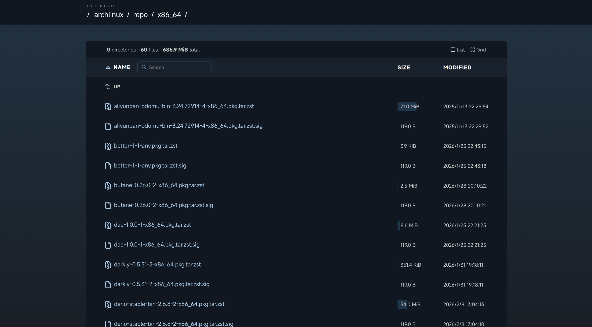

# s3-browser

   English | [简体中文](./README.zh.md)

## Screenshot



## Tech Stack

- Framework: [Astro](https://astro.build/)
- Platform: [Cloudflare Workers](https://workers.cloudflare.com/)
- Tooling: [Deno](https://deno.com/)
- S3 Client: [S3mini](https://github.com/good-lly/s3mini/)
- Type Safety: [TypeScript](https://www.typescriptlang.org/)

## Usage

### Local Development

1. Clone the repository
   ```bash
   git clone https://github.com/CAB233/s3-browser.git
   cd s3-browser
   ```

2. Install dependencies
   ```bash
   deno install
   ```

3. Configure Environment Variables
   ```
   cp .dev.vars.example .dev.vars
   ```

4. Run the application
   ```bash
   deno task dev
   ```

   Use `deno task check` for type checking, `deno task build` to check types and
   build, and `deno task preview` to preview the production build locally.

### Deploy to Cloudflare Workers

1. Configure Wrangler configuration file
   ```bash
   cp wrangler.toml.example wrangler.toml
   ```

2. Configure Secrets

   Before deploying, ensure you have set the required secret environment variables in your Cloudflare dashboard or via wrangler:
   ```bash
   deno run -A npm:wrangler secret put BUCKET_ENDPOINT
   deno run -A npm:wrangler secret put BUCKET_REGION
   deno run -A npm:wrangler secret put BUCKET_ACCESS_KEY_ID
   deno run -A npm:wrangler secret put BUCKET_SECRET_ACCESS_KEY
   deno run -A npm:wrangler secret put BUCKET_DOWNLOAD_URL
   ```

3. Build and Deploy
   ```bash
   deno task deploy
   ```

## Environment Variables

| Name | Description | Required | Default |
|------|-------------|----------|---------|
| `BUCKET_ENDPOINT` | The endpoint of the bucket. | Yes | - |
| `BUCKET_REGION` | The region of the bucket. | Yes | - |
| `BUCKET_ACCESS_KEY_ID` | The access key ID of the bucket. | Yes | - |
| `BUCKET_SECRET_ACCESS_KEY` | The secret access key of the bucket. | Yes | - |
| `BUCKET_DOWNLOAD_URL` | A publicly accessible URL to download objects. | Yes | - |
| `CACHE_BYPASS_PREFIXES` | Comma-separated directory paths that bypass listing caches. | No | Empty |
| `DISABLE_SE_INDEX` | Set to `true` to disable search engine indexing. | No | `true` |

### Cache Bypass

Each path covers the directory and its descendants. Leading and trailing slashes
are optional, and surrounding whitespace is trimmed. Set `/` to bypass caching
for all directories. An empty value keeps the default policy: 30 seconds of
freshness and another 60 seconds of stale content while refreshing in the
background.

Set `CACHE_BYPASS_PREFIXES` in `.dev.vars`:

```dotenv
CACHE_BYPASS_PREFIXES=/live/,/updates/
```

Or set it via wrangler:

```
deno run -A npm:wrangler secret put CACHE_BYPASS_PREFIXES
```

## License

MIT

## Acknowledgements

- [CaddyServer](https://github.com/caddyserver) for their [html template](https://github.com/caddyserver/caddy/blob/master/modules/caddyhttp/fileserver/browse.html) design.
- Forked from [rafiibrahim8/bucketlist](https://github.com/rafiibrahim8/bucketlist).
