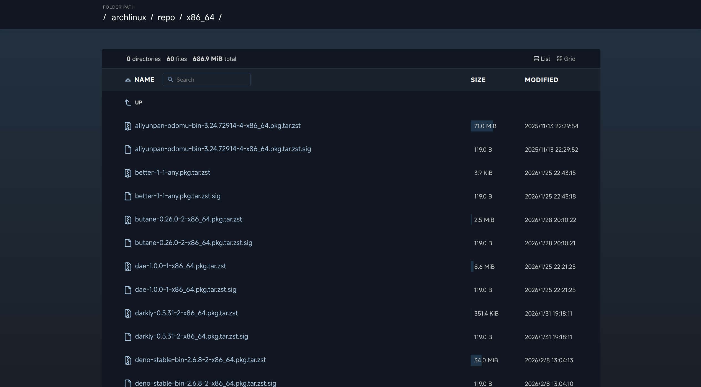

# s3-browser

   [English](./README.md) | 简体中文

## 截图预览



## 技术栈

- **框架**: [Astro](https://astro.build/)
- **平台**: [Cloudflare Pages](https://pages.cloudflare.com/)
- **运行时**: [Deno](https://deno.com/)
- **S3 客户端**: [S3mini](https://github.com/good-lly/s3mini/)
- **类型安全**: [TypeScript](https://www.typescriptlang.org/)

## 使用方法

### 本地开发

1. 克隆仓库
   ```bash
   git clone https://github.com/CAB233/s3-browser.git
   cd s3-browser
   ```

2. 安装依赖
   ```bash
   deno install
   ```

3. 配置环境变量

   将 `.dev.vars.example` 复制为 `.dev.vars` 并填入你的 S3 凭据。

4. 运行应用
   ```bash
   deno task dev
   ```

### 部署到 Cloudflare

1. 配置 Wrangler
   ```bash
   cp wrangler.toml.example wrangler.toml
   ```

2. 配置密钥

   在部署之前，请确保已在 Cloudflare 控制面板或通过 wrangler 设置了所需的密钥环境变量：
   ```bash
   deno run npm:wrangler secret put BUCKET_ENDPOINT
   deno run npm:wrangler secret put BUCKET_REGION
   deno run npm:wrangler secret put BUCKET_ACCESS_KEY_ID
   deno run npm:wrangler secret put BUCKET_SECRET_ACCESS_KEY
   deno run npm:wrangler secret put BUCKET_DOWNLOAD_URL
   ```

3. 构建并部署
   ```bash
   deno task build
   deno task deploy
   ```

## 环境变量

| 名称 | 描述 | 必填 | 默认值 |
|------|-------------|----------|---------|
| `BUCKET_ENDPOINT` | 存储桶端点。 | 是 | - |
| `BUCKET_REGION` | 存储桶区域。 | 是 | - |
| `BUCKET_ACCESS_KEY_ID` | 存储桶访问密钥 ID。 | 是 | - |
| `BUCKET_SECRET_ACCESS_KEY` | 存储桶机密访问密钥。 | 是 | - |
| `BUCKET_DOWNLOAD_URL` | 用于下载对象的公开访问 URL。 | 是 | - |
| `DISABLE_SE_INDEX` | 设置为 `true` 以禁用搜索引擎索引。 | 否 | `true` |

## 许可证

MIT

## 致谢

- [CaddyServer](https://github.com/caddyserver) 的 [html 模板](https://github.com/caddyserver/caddy/blob/master/modules/caddyhttp/fileserver/browse.html) 设计。
- Fork 自 [rafiibrahim8/bucketlist](https://github.com/rafiibrahim8/bucketlist)。
